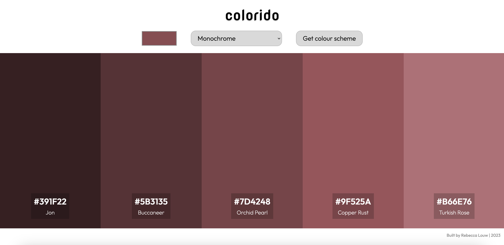
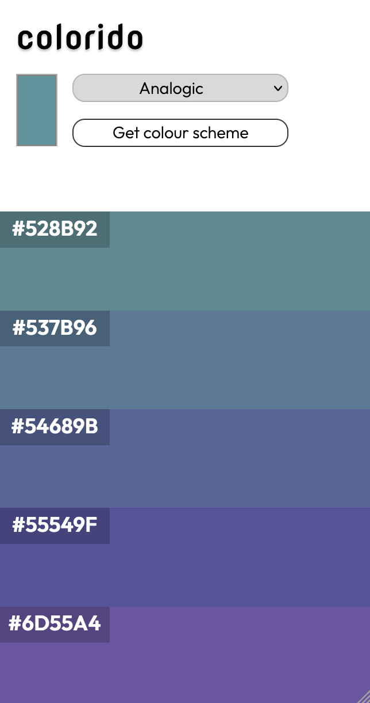

# Colorido 🎨 Colour Scheme Generator

#### ✨ Deployed/demo version 

## Demo overview
This fully responsive project generates colour palletes based on the seed colour that the user chooses, consuming data from 'The Color API'. 

Possible actions:
- Choosing the seed colour
- Choosing the colour scheme mode: monochrome, monochrome-dark, monochrome-light, analogic, complement, analogic-complement, triad or quad
- Colour scheme is displayed
- Copying the hex codes by clicking on them

## Developer overview
This was the first project that I built on my own consuming data from an API.
- The majority of the app was built with Javascript
- As soon as the user chooses the seed colour and colour scheme mode, that information is added to the link that fetches the data from the API
- The data is saved to an array which can be mapped over to display the colour itself, hex code and colour name
- A function was added so that clicking on the hex code will copy it to the clipboard
- The mobile version had it design adapted to not be overloaded with information but rather allow the user focus on the colour scheme generated

 

  .   

## API
- 

## Author: 
👩‍💻 Rebecca Louw 

## Built with:

  
 
  
